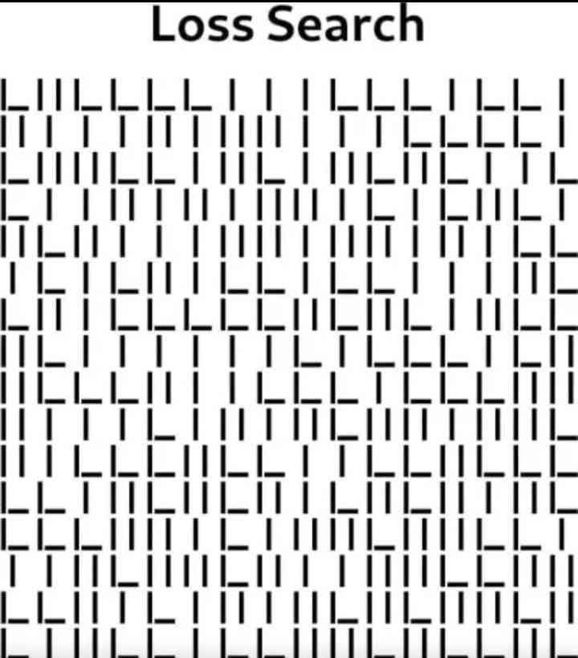

I think this is self explanatory

I need help

```python
import sys;a = list(map(lambda l: list(enumerate(zip(l, l[1:]))), map(lambda l: [l[i:i+2] for i in range(0, len(l), 2)], sys.stdin.read().split('\n'))));d = map(lambda y: list(map(lambda yl: (y[0], yl), y[1])), enumerate(map(lambda lo: map(lambda li: li[0][0], filter(lambda l: l[0][1] == ("| ", "||") and l[1][1] == ("||", "|_"), lo)), map(lambda l: zip(l[0], l[1]), zip(a, a[1:])))));print(list(d))
```
